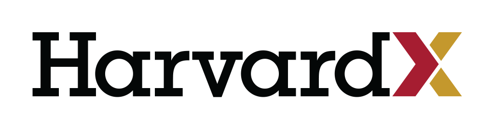

# CS50X

A repo archiving my journey through **CS50X**

---



---

<h2>Assignments</h2>

<h3>Week 0</h3>

* Starting from Scratch
    
    A simple game where you're a car and you have to dodge cones using the arrow keys using Scratch.

<h3>Week 1</h3>

* Hello, World
    
    A standard "Hello, world" in C.

* Hello, It's Me

    A simple "Hello, name" program in C.

* Mario | Advanced Version

    Print an ascii pyramid based on user input.

    Example:

    ```bash
       #  #
      ##  ##
     ###  ###
    ####  ####
    ```
* Cash

    Figure out the least amount of coins needed for change.

<h3>Week 2</h3>

* Exercises

    * Arrays
        
        Print an array where each value is double the previous

        Check if an array is in alphabetical order
